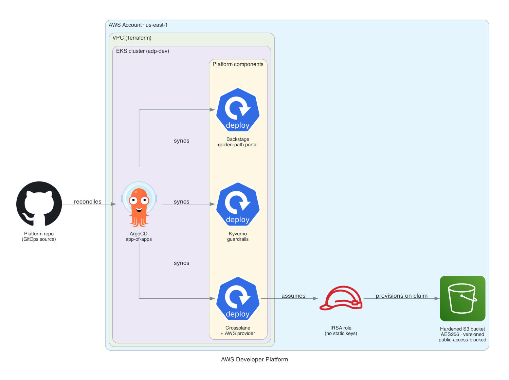

# AWS Developer Platform

An Internal Developer Platform on EKS that gives application teams a paved road: self-service infrastructure, GitOps delivery, golden-path scaffolding, and policy guardrails. Developers consume simple, safe abstractions; the platform handles the hardening, IAM, and reconciliation underneath.

## Architecture



| Layer | Tool | Role |
|---|---|---|
| Cluster substrate | **EKS** (Terraform) | VPC, managed node group, OIDC/IRSA, provisioned as code |
| GitOps | **ArgoCD** (app-of-apps) | Reconciles every platform component from this repo |
| Self-service infra | **Crossplane** + AWS provider | A `Bucket` claim provisions a real, hardened S3 bucket |
| Guardrails | **Kyverno** | Policy-as-code admission control |
| Developer portal | **Backstage** | Catalog plus a golden-path microservice template |

## The self-service flow

A developer applies a tiny claim (or uses the Backstage golden path):

```yaml
apiVersion: platform.jordann6.io/v1alpha1
kind: Bucket
metadata:
  name: demo-bucket
  namespace: team-apps
spec:
  parameters:
    region: us-east-1
    team: payments
```

Crossplane composes that into a real S3 bucket that is **hardened by default**, with no way for the developer to opt out:

- AES256 encryption
- Versioning enabled
- All four public-access-block settings on
- Owning-team tag applied

Crossplane authenticates to AWS via **IRSA** (the provider pod assumes an IAM role through its projected ServiceAccount token), so there are no static credentials anywhere in the platform.

## How it is wired

- **App-of-apps:** `platform/argocd/root-app.yaml` points ArgoCD at `platform/argocd/apps`, which declares one `Application` per component. Sync waves order the install (control planes first, then their configuration).
- **Crossplane:** `platform/crossplane/` holds the AWS provider (with an IRSA `DeploymentRuntimeConfig`), the `ProviderConfig`, and the `XRD` + `Composition` that define the `Bucket` API.
- **Kyverno:** `platform/kyverno/require-team-label.yaml` enforces an owning-team label on pods in namespaces labeled `team-policy=enforce`, scoped by namespace selector so platform and system namespaces are untouched.
- **Backstage:** `backstage/` is a real scaffolded app. The golden-path template at `backstage/templates/microservice/` produces a new service complete with a Dockerfile, a hardened Helm chart, and an ArgoCD `Application`, so a new service is GitOps-deployable on this platform the moment it is created.

## Deploy

```bash
# 1. Provision the cluster
cd terraform
terraform init
terraform apply
eval "$(terraform output -raw configure_kubectl)"

# 2. Bootstrap GitOps
helm repo add argo https://argoproj.github.io/argo-helm && helm repo update
helm install argo-cd argo/argo-cd -n argocd --create-namespace \
  --set dex.enabled=false --set notifications.enabled=false --set applicationSet.enabled=false
kubectl apply -f platform/argocd/root-app.yaml
```

ArgoCD then reconciles Crossplane, Kyverno, and Backstage from this repo.

## Try the self-service path

```bash
kubectl create namespace team-apps
kubectl apply -f examples/bucket-claim.yaml

# Watch the claim go Ready, then confirm the real bucket is hardened
kubectl get bucket.platform.jordann6.io -n team-apps
BUCKET=$(kubectl get bucket.s3.aws.upbound.io -o jsonpath='{.items[0].status.atProvider.id}')
aws s3api get-bucket-encryption --bucket "$BUCKET"
aws s3api get-bucket-versioning --bucket "$BUCKET"
aws s3api get-public-access-block --bucket "$BUCKET"

# Reclaim: deleting the claim deletes the bucket
kubectl delete bucket.platform.jordann6.io/demo-bucket -n team-apps
```

## Guardrail demo

```bash
kubectl create namespace demo && kubectl label namespace demo team-policy=enforce
# Denied: no team label
kubectl run nginx --image=nginx -n demo
# Allowed: team label present
kubectl run nginx --image=nginx -n demo --labels=app.kubernetes.io/team=payments
```

## Teardown

```bash
# Delete Crossplane claims first so managed AWS resources are removed
kubectl delete bucket.platform.jordann6.io --all -A
cd terraform && terraform destroy
```

Order matters: Crossplane-managed resources live outside the cluster, so claims are deleted before the cluster is torn down to avoid orphaned buckets.

## Cost

The only meaningful cost is the EKS cluster while it runs: control plane (~$0.10/hr) plus two `t3.large` nodes and a single NAT gateway, roughly $0.40 to $0.60/hr. This is a spin-up, demo, tear-down environment.

## Tech Stack

- **Terraform** `>= 1.6` with `terraform-aws-modules/eks` and `vpc`, S3 state backend
- **Amazon EKS** v1.33, managed node group, IRSA/OIDC
- **ArgoCD** app-of-apps GitOps
- **Crossplane** 1.20 with the Upbound AWS S3 provider, IRSA auth, XRD + Composition
- **Kyverno** 1.13 policy-as-code
- **Backstage** scaffolder golden-path template
